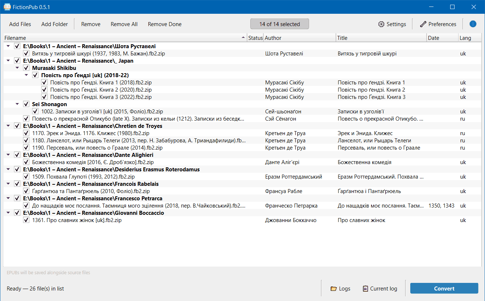
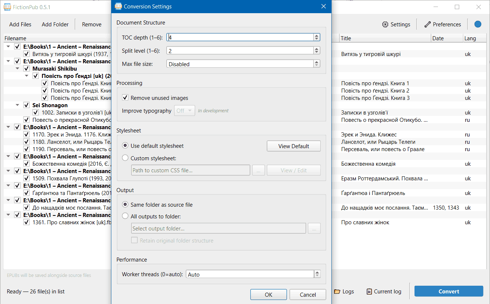
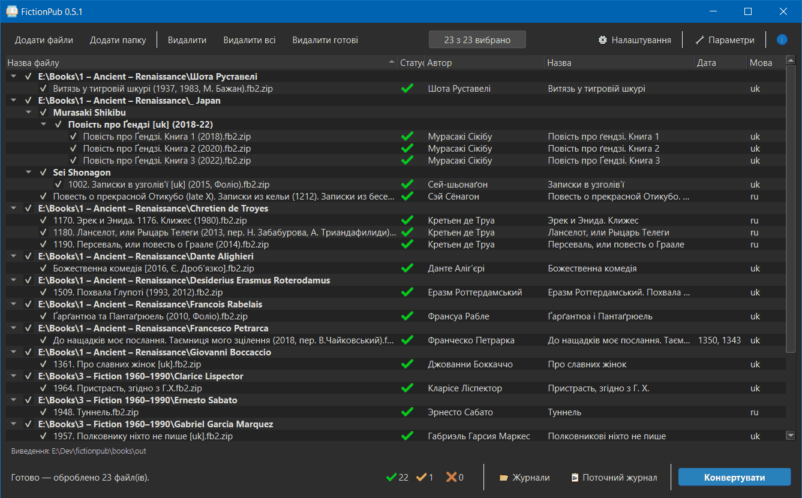
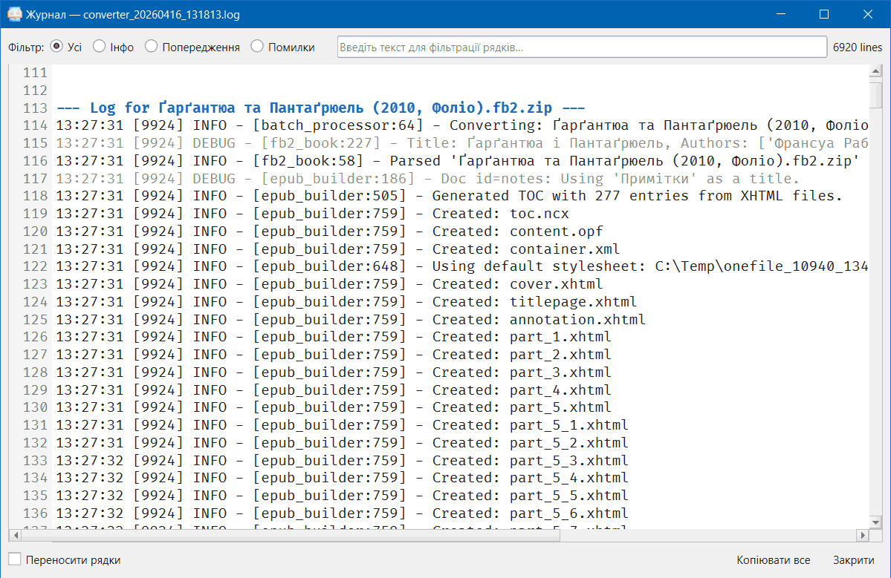

🇬🇧 [English](README.md) | 🇺🇦 [Українська](README.uk.md)

# FictionPub

**FB2 → EPUB3 converter** — batch-capable, with a GUI and a CLI.

<table>
  <tr>
    <td></td>
    <td></td>
  </tr>
  <tr>
    <td></td>
    <td></td>
  </tr>
</table>

---

## Features

- **Batch conversion** — add individual files, entire folders, or any mix; all processed in parallel.
- **Faithful output** — original FB2 structure, content, and metadata are preserved in the EPUB.
- **Proper markup** — valid XHTML with semantic tags; no generic `<div class="123">` tags.
- **Table of Contents** — configurable heading depth (h1–h6) for both EPUB3 nav and EPUB2 NCX.
- **Footnote semantics** — EPUB3 `epub:type` markup lets readers render footnotes as popups or at the bottom of a page.
- **EPUB2 compatibility** — NCX and `<guide>` are generated alongside EPUB3 structures.
- **Stylesheet support** — ships with a clean built-in CSS; any custom `.css` file can be substituted.
- **Passes epubcheck** — output is spec-compliant.

**User interface**
- Ukrainian / English language.
- Light / Dark themes.
- CSS viewer / editor.
- Log viewer.


**Planned**
- UI to perform CSS tweaks
- Typography post-processing (non-breaking spaces, no-break spans).
- Image optimization (JPEG downscaling, pngquant for grayscale PNGs).
- Splitting of huge XHTML files into smaller chunks for faster rendering.
- Graceful handling of non-standard FB2 structures.
- Auto updater.

---

## Usage

### GUI (primary)

Download the latest portable `fictionpub.exe` from the [Releases](https://github.com/TinyRaindrop/fictionpub/releases/latest) page — no installation required, just run it.

**Basic workflow:**

1. **Add files** — use *Add Files* / *Add Folder* in the toolbar or drag&drop. Subfolders are scanned recursively.
2. **Tweak settings** — click *⚙ Settings* to adjust TOC depth, chapter split level, output folder, and stylesheet.
3. **Select output** — choose *Same folder as source* (default) or specify a destination folder, optionally mirroring the original directory structure.
4. **Convert** — press **Convert**. Progress and per-file status (✓ / ⚠ / ✗) are shown in real time.
5. **Inspect logs** — click any status icon to view that file's conversion log, or open the full log from the bottom bar.
Status ⚠ Warning means successful conversion, but source FB2 had some minor errors (missing image, broken link or footnote, etc). Status ✗ Failure means that Epub was not created.
Double-clicking a successfully converted file opens the EPUB directly.
Right click opens a context menu.

---

### CLI

```
fictionpub_cli.exe <input> [options]
```

`<input>` can be one or more `.fb2` / `.fb2.zip` files or folders, separated by spaces.

| Option | Default | Description |
|---|---|---|
| `-o, --output PATH` | next to source | Output folder. |
| `-t, --toc-depth N` | `4` | Maximum heading level to include in TOC (1–6). |
| `-s, --split-level N` | `2` | Split chapters into separate files at this heading level (1–6). |
| `-c, --css PATH` | built-in | Path to a custom CSS file. |
| `--threads N` | `0` | Number of parallel worker processes. `0` = auto-detect. |

**Examples:**

```bash
# Convert a single file, output next to source
fictionpub_cli.exe book.fb2

# Convert a folder, send all EPUBs to E:\output\
fictionpub_cli.exe D:\books\ -o E:\output\

# Convert multiple folders, deeper TOC, 4 threads
# Usage of -o mirrors folder structure: will create d\books and e\docs folders inside E:\output
fictionpub_cli.exe D:\books\ E:\docs\ -o E:\output\ -t 6 --threads 4
```

Run `fictionpub_cli.exe --help` to see all options.

---

## Installation

### As a Python package

Requires **Python 3.12+**.

```bash
pip install git+https://github.com/TinyRaindrop/fictionpub.git
```

Run GUI (no arguments):

```bash
python -m fictionpub
```

Run CLI:

```bash
python -m fictionpub <input> [options]
```

Works on Windows, macOS, and Linux. The GUI requires Qt6/PySide6, which is installed automatically as a dependency.

---

### For development

```bash
git clone https://github.com/TinyRaindrop/fictionpub
cd fictionpub
pip install -e ".[dev]"
```

**Building a portable `.exe` with Nuitka** (Windows, Python 3.12):

```bash
python build.py
```

Prerequisites for building:
- MSVC compiler (or switch to MinGW-w64 in `build_exe.py`)
- `make` is optional for makefile scripts (`make exe`) (install with `winget install GnuWin32.Make`)

---

## Credits
Icons by Freepik - [Flaticon](www.flaticon.com)